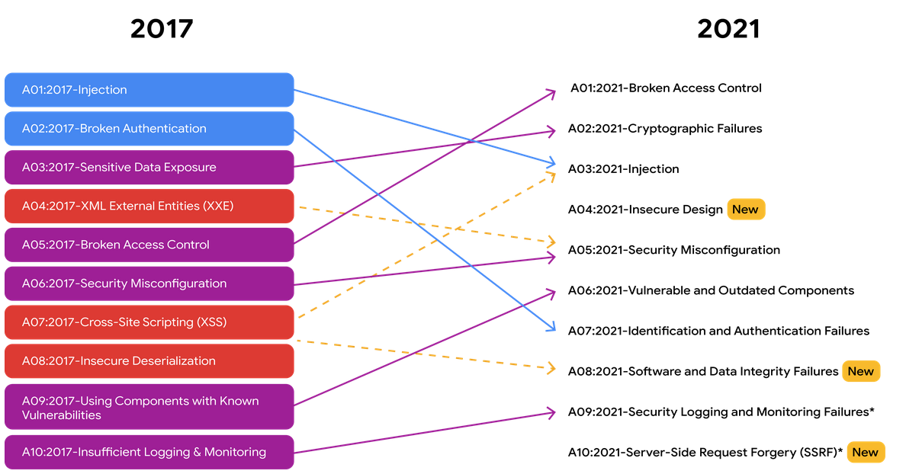
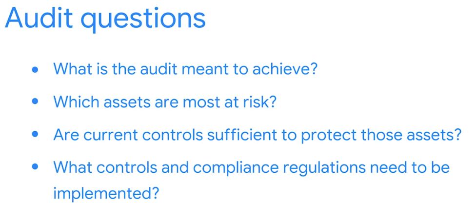

# 2 . Manage Security Risks

**1. Security Domains**

**2. Security Frameworks and Controls**

**3. Intro to Cybersecurity Tools**

**4. Use Playbooks to Response to Incidents**

## 1. CISSP Security Domains

Security teams use them to organize daily tasks and identify gaps in security that could cause negative consequences for an organization, and to establish their **security posture**.

**Security Posture**: An organization's ability to manage its defences of critucal assets and data, and react to change.

The focus of the following security domains are:

### D1 - Security and Risk Management

Focused on defining security goals and objectives, risk mitigation, compliance, business continuity, and legal regulations.

### D2 - Asset Security

Focused on securing digital and physical assets. It's also related to the storage, maintenance, retention, and destruction of data.

### D3 - Security Architecture and Engineering

Focused on optimizing data security by ensuring effective tools, systems, and processes are in place to protect an organization's assets and data.

### D4 - Communication and Network Security

Focused on managing and securing physical networks and wireless communications.

### D5 - Identity and Access Management

Focused on access and authorization to keep data secure, by making sure users follow established policies to control and manage assets.

**Components of IAM:**

- Identification (User, access card, etc)
- Authentication (password)
- Authorization (relates to the level of access)
- Accountability (Monitoring and recording user actions)

### D6 - Security Assessment and Testing

Focused on conducting security control testing, collecting and analyzing data, and conducting security audits to monitor for risks, threats and vulnerabilities.

### D7 - Security Operations

Focused on conducting investigations and implementing preventative measures.

### D8 - Software Development Security

Focused on using secure coding practices.

### Threats, risks, and vulnerabilities

#### Threat

any circumstance or event that can negative impact assets.

Ex, A social engineering attack.

#### Risks

Anything that can impact the condifentiality, integrity, or availability of an asset.

Ex, The lack of backup protocols.

1. Low-risk asset: Information that would not harm the organization's reputation or ongoing operations, and would not cause financial damage if compromised. Ex, Web-site information or publish research data
2. Medium-risk asset: Information that's not available to the public and may cause some damage to the organization's finances, reputation, or ongoing operations. Ex, early release of the quarterly earning.
3. High-risk asset:Information protected by regulations or laws, which if compromised would hace a severe negative impact on an organization's finances, ongoing operations, or reputation. Ex, any leak assets with SPII, PII, or intelectual properties.

#### Vulnerability

A weakness that can be exploited by a threat.

Ex, outdated firewall or systems, week passwords, or people.

### Key Impacts of Threats, Risks, and Vulnerabilities

#### Financial Impact

When an organization's assets are compromised by an attack, such as the use of malware, the financial consequences can be significant for a variety of reasons. These can include interrupted production and services,
the cost to correct the issue, and fines if assets are compromised
because of non-compliance with laws and regulations

#### Identity Theft

Storing any type of sensitive data presents a risk to the organization.
Sensitive data can include personally identifiable information, or PII, which can be sold or leaked through the dark web. That's because the dark web provides a sense of secrecy and threat actors may have the ability to sell data there without facing legal consequences.

#### Reputation

An exploited vulnerability can lead customers to seek new business
relationships with competitors or
create bad press that causes permanent damage to an organization's reputation.
The loss of customer data doesn't only affect an organization's reputation and
financials, it may also result in legal penalties and fines.

#### NIST'S Risk Management Framework (RMTF)

The RMF Steps are:

1. **Prepare**: Activities that are necessary to manage security and pticavy risks before a breach occurs.

2. **Categorize**: Used to develop risk management processes and tasks.

3. **Select**: Choose, customize, and capture documentation for the controls that protect an organization.

4. **Implement**: Implement security and pruvacy plans for the organization.

5. **Assess:** Determine if established controls are implemented correctly.

6. **Authorize:** Being accounable for the security and privacy risks that may exist in an organization.

7. **Monitor:** Be aware of how systems are operating.

### Manage Common Threats, Risks, and Vulnerabilities

#### Threats

- **Insider Threats:** Staff members or vendor abuse their authorized access to obtain data that may harm an organizaion.
- **Advanced Persistent Threats (APTs):** A threat actor maintains unauthoried access to a system fro an extended period of time.

#### Risks

Different factors that can affect the likelihood of a risk:

- **External Risk:** Anything outside the organization that has the potential to harm assets
- **Internatl Risk:** A current or former employee, vendor or trusted partner who poses a security risk. -**Legacy Systems:** Old systems that might not be accounted for or updated, but can still impact assets. -**Multiparty Risk:** Outsourcing work to third-party vendors can give them access to intellectual property. -**Software Compliance/Licensing**: Software that is not updated or in compliance, or patches that are not installed in a timelyy manner.

#### Vulnerabilities

- **ProxyLogon**: A threat actor can complete a user authentication rpcess to deploy malicious code from a remote location.

- **ZeroLogon:** A vulnerability in Mocrosoft's Netlogon authentication protocol. **Netlogon** is a service that ensures a user's identity before allowing accesss to a website's location.

- **Log4Shell:** Allows attackers to run Java code on someone else's computer or leak sensitive information. It does this by enabling a remote attacker to take control of devices connected to the internet and run malicious code.

- **PetitPotam**: Affects Windows New Technology Local Area Network (LAN) Manager (NLM). It is a theft technique that allows a LAN-based attacker to initiate an authentication request.

- **Security Logging and Monitoring Failures:** Insufficient loggins and monitoring capabilities.

- **Server-side Request forgery:** Allows attackers to manipulate a server-side application into accessing and updating backend resources. It can also allow threat actors to steal data.

Links for more:

https://csrc.nist.gov/projects/risk-management/about-rmf
https://owasp.org/www-project-top-ten/

## 2. Security Frameworks and Controls

### Security Frameworks

Are guidelines used for building plans to help mitigate risk and threats to data and privacy.
For example, the healthcare industry uses frameworks to comply with the United States’ Health Insurance Portability and Accountability Act (HIPAA), which requires that medical professionals keep patient information safe.

### Security Controls

Are safeguard to reduce specific security risks.
Most common controls to protect sensitive data:

1. Encryption: The process of converting data from a readable format to an encoded format. Normal text to cypher data.
2. Authentication: The process of verifying someone or something is.
3. Authorization: The concept of granting access to specific reources within a system.

### CIA Triad

A model that helps inform how organizations consider risk when setting up systems and security policies.

#### Use the CIA Triad to Protect Organizations

Maintaining an accepatable level of risk and ensuring systems and policies are designed with these elemnts in ind helps establish a successfu security posture, which refers to an oganization's ability to manage its defense of critical assets and data and react to change.

- **Confidentiality** can be enhanced through the implementation of design principles, such as tehe principle of least privilige. Limiting acces is one wat of maintining the confidentiality and security of private data.
- Having protocls in place to verify the authenticity, **Integrity** of data is essential. One way is through cryptography. Used to transform data so unauthorized parties connot read or tamper with it. Or by enabling encription, preventing access and ensure data cannot be tempered with.
- When a system adheres to both **Availability** and confidentiality principles, data can be used when needed. Organizations could allow remote employees to acces its internal network to perform their jobs.

### NIST Frameworks

The core functions of the NIST CSF provide specific guidance and
direction for security professionals.
This framework is used to develop plans to handle an incident appropriately and quickly to lower risk, protect an organization against a threat, and mitigate any potential vulnerabilities.

#### NIST S.P 800-536

A unified framework for protecting the security of information systems within the federal government.

#### NIST CSF Functions

1. **Govern**: emphasizes the importance of strong cybersecurity governance across all levels of the organization. It's about establishing and maintaining the structures and processes needed to effectively manage cybersecurity risk. This includes things like setting clear cybersecurity objectives, ensuring leadership commitment, developing and implementing a comprehensive risk management strategy, and continuously improving cybersecurity performance.

2. **Identify**: The management of cybersecurity risk and its effect on an organization's people and assets.
   Ex, asked to monitor the systems and devices on the organization's network to invesitgate posible risks and vulnerabilities.

3. **Protect**: The strategy used to protect an organization through the implementation of policies, procedures, training, and tools that help mitigate cybersecurity threats.
   Ex, studying historical data and upgrading procedures is essencial.

4. **Detect**: Identifying potential security incidents and improving monitoting capabilities to increase the speed and efficiency of detections.
   Ex, Reviewing a new system and flaging any potetial risk or incidents to the security team.

5. **Respond:** Making sure that the proper procedures are used to contain, neutralize, and analyze security incidents, and implement improvements to the security process.
   Ex, collect and organize data to document and incident. To then be able to make improvents to prevent the incident for happening again.

6. **Recover**: The process of returning affected systems back to normal operation.
   Ex, restore systems, data or assets that had been affected by a breach.

### Open Web Applications Security Projects (OWASP) Security Principles

#### Minimize attack surface area

All the potential vulnerabilities an attacker could expose. Ex, phising email and week password.To minimize the attack surface and avoid incidents from these types of vectors, security teams might disable software features,
restrict who can access certain assets, or establish more complex password requirements.

#### Least Privilige

Making sure that users have
the least amount of access
required to perform their everyday tasks. The main reason for limiting access to organizational information and resources is to reduce the amount of damage a security breach could cause.
For example, as an entry-level analyst,
you may have access to log data,
but may not have access to change user permissions.

#### Defense in Depth

Organization should have
multiple security controls that
address risks and threats in different ways. One example of a security control is multi-factor authentication, or MFA,
which requires users to take
an additional step beyond simply
entering their username and
password to gain access to an application. Other controls include firewalls,IDS and permission settings.

#### Separation of Duties

Used to prevent individuals from
carrying out fraudulent or illegal activities. This principle means that no one should be given so many privileges that they can misuse the system.For example, the person in a company who signs the paychecks shouldn't also be the person who prepares them.

#### Keep Security Simple

Keep security simple is
the next principle. As the name suggests, when implementing security controls, unnecessarily complicated solutions should be avoided because they can become unmanageable.
The more complex the security controls are, the harder it is for people to work collaboratively.

#### Fix Security Issues Correctly

When a security incident occurs,
security professionals are expected to
identify the root cause quickly.
From there, it's important to correct
any identified vulnerabilities and
conduct tests to ensure that repairs are successful.

### Plan A Security Audit

**Security Audit**: A review of an organization's security controls, policies, and procedures against a set of expectations. Audits can be internal and externals.
Purposes of internal security audit:

- Identify organizational risk
- Assess controls
- Correct compliance issues

### Common elements of internal audits:

[Assestment_and_Auditing_Resources](https://www.nist.gov/cyberframework/assessment-auditing-resources)

#### 1. Establishing the scope and goals

**Scope:** Refers to the specific criteria of an internal security audit.

**Goals:** Are an outline of the organization's security objectives.

Example: [Audit_Scope_and_Goals](./Resources/Audit%20Scope%20and%20Goals.pdf)

#### 2. Conducting a risk assessment,

Focused on identifying
potential threats, risks, and vulnerabilities. This helps organizations consider what security measures should be implemented and monitored to ensure the safety of assets.

For example, this risk assessment
highlights that there are inadequate controls, processes, and procedures in
place to protect the organization's assets. Specifically, there is a lack of proper management of physical and digital assets, including employee equipment. The equipment used to
store data is not properly secured.
And access to private information stored in the organization's internal network likely needs more robust controls in place.

#### 3. Completing a controls assessments

A controls assessment involves closely reviewing an organization's existing
assets, then evaluating potential risks to those assets,
to ensure internal controls and processes are effective.
Classifying controls into the following categories: **administrative controls**, **technical controls**, and **physical controls**.

More on Control Categories: [Control_Categories](./Security%20Audit%20Ex/Control%20categories.pdf)

#### 4. Assessing compliance

Determining whether or not the organization is adhering to necessary compliance regulations.

#### 5. Communicating results

Once the internal security audit is complete, results and
recommendations need to be communicated to stakeholders.

- Summarizes scope and goals,
- Lists existing risks,
- Notes how quickly those risks need to be addressed,
- Identifies compliance regulations,
- Provides recommendations.

## 3. Intro to Cybersecurity Tools
