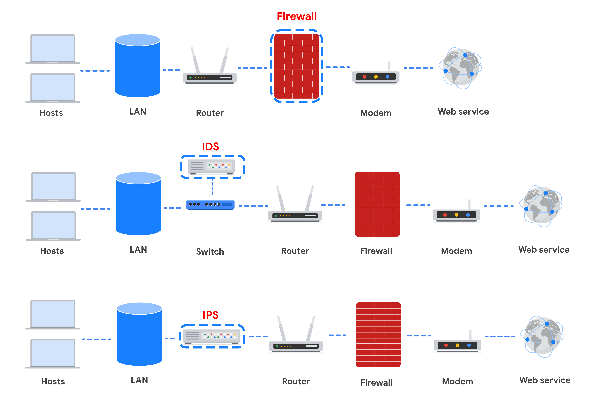

# Connect and Protect: Networks and Network Security

**Module 1: Network architecture**

**Module 2: Network operations**

**Module 3: Secure against network intrusions**

**Module 4: Security hardening**

## 1: Network architecture

A **Network** is a group of connected devices.

Common devices that make up
a network:

- A **Hub** is a network device that
  broadcasts information to every device on the network.
- A **Switch** makes connections between
  specific devices on a network by sending
  and receiving data between them.
  A switch is more intelligent than a hub.
  It only passes data to the intended destination.
  This makes switches more secure than hubs,
  and enables them to control the flow of traffic
  and improve network performance.
- A **Router** is a network device that
  connects multiple networks together.
- A **Modem** is a device that connects
  your router to the internet,
  and brings internet access to the LAN.
- **Virtualization tools** are pieces of
  software that perform network operations.
  Virtualization tools carry out operations
  that would normally be completed by a hub, switch,
  router, or modem,
  and they are offered by Cloud service providers.
- A **Firewall** is a network security device that monitors traffic to or from your network. It is like your first line of defense. Firewalls can also restrict specific incoming and outgoing network traffic.

### Cloud Networks

**Cloud computing** is the practice of using remote servers, applications, and network
services that are hosted on the internet instead of on local physical devices.

A **cloud network** is a collection of servers or computers that stores resources and
data in a remote data center that can be accessed via the internet.

A **cloud service provider (CSP)** is a company that offers cloud computing services. CSPs provide three main categories of services:

- Software as a service (SaaS)
- Infrastructure as a service (IaaS)
- Platform as a service (PaaS)

### Intro to Network Connections

Communication over a network happens when data is transferred from one point to
another. Pieces of data are typically referred to as data packets.

A **data packet** is a basic unit of information that travels from one device to another within a network.
When data is sent from one device to another across a network, it is sent as
a packet that contains information about where the packet is going, where it's
coming from, and the content of the message.

- **Header:** includes the internet protocol address, the IP address, and the media access control, or MAC, address of the destination device. It also includes a protocol number that tells the receiving device what to do with the information in the packet.
- **Body:** contains the message that needs to
  be transmitted to the receiving device.
- **Footer:** similar to a signature on a letter,
  the footer signals to the receiving device that the packet is finished.

Network performance could be measure by bandwidth.
**Bandwidth** refers to the amount of data a device receives every second.
You can calculate bandwidth by dividing the quantity of data by the time in
seconds. Speed refers to the rate at which data packets are received or downloaded.

**Packet sniffing** is the practice of capturing and inspecting data packets across the network.

### The TCP/IP Model

**Transmission Control Protocol (TCP)** is an internet communication protocol that allows
two devices to form a connection and stream data.
The protocol includes a set of instructions to
organize data, so it can be sent across a network.
It also establishes a connection between two devices
and makes sure that packets
reach their appropriate destination.

**Internet Protocol (IP)** is a set of standards used for routing and addresing data packets as they travel between devices on a network.

When data packets are sent and received across a network,
they are assigned a **port**. A port is a software-based location that organizes
the sending and receiving of data
between devices on a network.
Ports divide network traffic into segments
based on the service they will perform
between two devices.
The computers sending and
receiving these data segments know how to
prioritize and process these segments
based on their port number.

### Layers of the TCP/IP Model

#### Network Access Layer

deals with the creation of data packets and their transmission across a network. This layer corresponds to the physical hardware involved in network transmission. Hubs, modems, cables, and wiring are all considered part of this layer. The address resolution protocol (ARP) is part of the network access layer.

#### Internet Layer

is responsible for ensuring the delivery to the destination host, which potentially resides on a different network. It ensures IP addresses are attached to data packets to indicate the location of the sender and receiver. The internet layer also determines which protocol is responsible for delivering the data packets and ensures the delivery to the destination host.

- **Internet Protocol (IP):** sends the data packets to the correct destination and relies on the Transmission Control Protocol/User Datagram Protocol (TCP/UDP) to deliver them to the corresponding service. IP packets allow communication between two networks. They are routed from the sending network to the receiving network. TCP in particular retransmits any data that is lost or corrupt.

- **Internet Control Message Protocol(ICMP):**Shares error information and status updates of data packets. Reports about packets that were dropped or disappeared in transit, issues with network connectivity and packets redirected to other routers.

#### Transport Layer

is responsible for delivering data between two systems or networks and includes protocols to control the flow of traffic across a network

- **Transmission Control Protocol (TCP):** is an internet communication protocol that allows two devices to form a connection and stream data. It ensures that data is realiably transmitted to the destination service. TCP contains the port number of the inteded destination service, which resides in the TCP header of a TCP/IP Packet.

- **User Datagram Protocol (UDP)** is a connectionless protocol that does not establish a connection between devices before transmissions. It is used by appplications that are not concerned with the reliability of the tramission. Data sent over UDP is not tracked as extensively as data sent using TCP- Becasuse USP does not establish networks connections, it is udes mostly for perfomance sensitive applications that operate in real time, such as video streming.

#### Application Layer

is responsible fror making network request or responding to requests. This layer defines which internet services and applications any user can access. Protocols in this layer determine how the data packet will interact with receiving devices.

- HTTP
- SMTP
- SSH
- FTP
- DNS

### OSI Model

#### Layer 7: Application Layer

Includes all of the networking protocols that software applications use to connect a user to the internet. User connection to the internet via applications and request. Ex, using a web browser. ( HTTP/S - SMTP - DNS)

#### Layer 6: Presentation Layer

involve data translation and encryption for the network. It adds to and replaces data with formats that can be understood by applications on both sending and receiving systems. Ex, SSL which encrypts data between servers and browsers as part of websites with HTTPS.

#### Layer 5: Session Layer

An open session allows the devices to communcaite with each other. Session layer protocols keep the session open while data is being transferred and terminate the session once the trasmission is complete. Resposible for authentication, reconnection, and setting checkpoints during a data transfer.

#### Layer 4: Transport Layer

Responsible for delibering data between devices and handles the speed of data transfer, flow of the transfer, and breaking data down into smaller segments. TCP and UDP are transport layer protocols.

#### Layer 3: Network Layer

Oversees recieving the frames from the data link layer and delivers them to the intended destination. Data packets allow communication between two networks. These packets include IP addresses that tell routers where to send them. They are routed from the sending network to the receiving network.

#### Layer 2: Data Link Layer

Organizes sending and receiving data packets within a single network. Home to switches and network interface cards. NCP, HDLC and SDLC are used at the data link layer.

#### Layer 1: Physical Layer

Corresponds to the pysical hardware involve in network transmission. Hubs, modems, and the cables and wiring that connect them are all considered part of the physical layer.

### Components of Network Layer Communication

There are 13 fields within the header of an IPv4 packet:

- **Version (VER):** This 4 bit component tells receiving devices what protocol the packet is using. The packet used in the illustration above is an IPv4 packet.

- **IP Header Length (HLEN or IHL):** HLEN is the packet’s header length. This value indicates where the packet header ends and the data segment begins.

- **Type of Service (ToS):** Routers prioritize packets for delivery to maintain quality of service on the network. The ToS field provides the router with this information.

- **Total Length:** This field communicates the total length of the entire IP packet, including the header and data. The maximum size of an IPv4 packet is 65,535 bytes.

- **Identification:** IPv4 packets can be up to 65, 535 bytes, but most networks have a smaller limit. In these cases, the packets are divided, or fragmented, into smaller IP packets. The identification field provides a unique identifier for all the fragments of the original IP packet so that they can be reassembled once they reach their destination.

- **Flags:** This field provides the routing device with more information about whether the original packet has been fragmented and if there are more fragments in transit.

- **Fragmentation Offset:** The fragment offset field tells routing devices where in the original packet the fragment belongs.

- **Time to Live (TTL):** TTL prevents data packets from being forwarded by routers indefinitely. It contains a counter that is set by the source. The counter is decremented by one as it passes through each router along its path. When the TTL counter reaches zero, the router currently holding the packet will discard the packet and return an ICMP Time Exceeded error message to the sender.

- **Protocol:** The protocol field tells the receiving device which protocol will be used for the data portion of the packet.

- **Header Checksum:** The header checksum field contains a checksum that can be used to detect corruption of the IP header in transit. Corrupted packets are discarded.

- **Source IP Address:** The source IP address is the IPv4 address of the sending device.

- **Destination IP Address:** The destination IP address is the IPv4 address of the destination device.

- **Options:** The options field allows for security options to be applied to the packet if the HLEN value is greater than five. The field communicates these options to the routing devices.

## 2: Network operations

A **network protocol** is a set of rules used by two or more devices on a network to describe the order of delivery and the structure of data. Network protocols serve as instructions that come with the information in the data packet.

Three categories of network protocols:

- **Communication Protocols:** govern the exchange of information in network transmission. They dictate how the data is transmitted between devices and the timing of the communication. They also include methods to recover data lost in transit. Ex: **TCP**, **UDP**, **HTTP**, **DNS**.

- **Management Protocols**: They are used for monitoring and managinf acativity on a network. They include protocols for error reporting and optimizing performance on the network. Ex, **SNMP**, **ICMP**.

- **Security Protocols**: Are network protocols that ensure that data is sent and recived securely across a network. Security protocols use encryption algorithms to protect data in transit. Ex, **HTTPS**, **SFTP**

| Protocolo | Puerto                                |
| --------- | ------------------------------------- |
| DHCP      | UDP puerto 67 (servidores)            |
|           | UDP puerto 68 (clientes)              |
| ARP       | ninguno                               |
| Telnet    | TCP puerto 23                         |
| SSH       | TCP puerto 22                         |
| POP3      | TCP/UDP puerto 110 (sin cifrar)       |
|           | TCP/UDP puerto 995 (cifrado, SSL/TLS) |
| IMAP      | TCP puerto 143 (sin cifrar)           |
|           | TCP puerto 993 (cifrado, SSL/TLS)     |
| SMTP      | TCP/UDP puerto 25 (sin cifrar)        |
| SMTPS     | TCP/UDP puerto 587 (cifrado, TLS)     |

---

- **DHCP (Dynamic Host Configuration Protocol):** Protocolo que asigna dinámicamente direcciones IP a dispositivos en una red.
- **ARP (Address Resolution Protocol):** Protocolo que traduce direcciones IP a direcciones MAC dentro de una red local.
- **Telnet:** Protocolo que permite el acceso remoto a dispositivos a través de una conexión sin cifrar.
- **SSH (Secure Shell):** Protocolo seguro para acceso remoto y transferencia de archivos mediante cifrado.
- **POP3 (Post Office Protocol v3):** Protocolo utilizado para la recepción de correos electrónicos desde un servidor.
- **IMAP (Internet Message Access Protocol):** Protocolo que permite la gestión de correos electrónicos en un servidor sin descargarlos localmente.
- **SMTP (Simple Mail Transfer Protocol):** Protocolo utilizado para el envío de correos electrónicos entre servidores.
- **SMTPS (SMTP Secure):** Versión cifrada de SMTP que utiliza TLS para proteger la transmisión de correos electrónicos.

## Wireless Protocols

_IEEE 802.11 (Wifi)_:
A set of standards that define communications for wireless LANs

_WPA ( Wifi Protected Access)_: A wireless security protocol for devices to connect to the internet

Evolution of wireless security protocols from WEP to WPA, WPA2, and WPA3

_Temporal Key Integrity Protocol (TKIP)_
key reinstallation attack (or KRACK attack)

### WPA3

WPA3 is a secure Wi-Fi protocol and is growing in usage as more WPA3 compatible devices are released. These are the key differences between WPA2 and WPA3:

- WPA3 addresses the authentication handshake vulnerability to KRACK attacks, which is present in WPA2.

- WPA3 uses Simultaneous Authentication of Equals (SAE), a password-authenticated, cipher-key-sharing agreement. This prevents attackers from downloading data from wireless network connections to their systems to attempt to decode it.

- WPA3 has increased encryption to make passwords more secure by using 128-bit encryption, with WPA3-Enterprise mode offering optional 192-bit encryption.

## System Identification

### Firewall

_Firewall:_ A network security device that monitors traffic to an from your network.
_Port Filtering:_ A firewall funcion that blocks or allows certain port numbers to limit unwanted communication

A _hardware firewall_ inspects each data packet before it's allowed to enter the network.
A _software firewall_ performs the same functions as a hardware firewall,but it's not a physical device.Instead, it's a software program Installed on a computer or on a server.
A _cloud-based firewall_ is a software firewalls that are hosted by a cloud service provider.

_Stateful firewalls_: A class of firewall that keeps trackf of information passing through it and proactively filters out threats.
_Stateless firewalls:_ A class of firewall that operates based on prefefined rules and dodes not keep track of information from data packets

#### Next Generation Firewalls (NGFWs)

Benefits of NGFWs:

- Deep packet inspection
- Intrusion protection
- Threat intelligence

### Virtual Private Networks (VPNs)

When you connect to the internet, your internet service provider receives your network's requests and forwards it to the correct destination server. But your internet requests include your private information. That means if the traffic gets intercepted, someone could potentially connect your internet activity with your physical location and your personal information.

_VPN_: A network security service that changes your public IP address and hides your virtual location so that you can keep your data private when you are using a public network like the internet.Encrypts your data and encapsulates the data in transit

_Encapsulation_: A process performed by a VPN service that protects your data by wrapping sensitive data in other data packets

### Security Zones

Control who can access different segment of a network.

_Network Segmentation_: A security technique that divides the network into segments

_Uncontrolled Zone_: Any network outside of the organization's control. i.e: the internet.
_Controlled Zone_: A subnet that protects the internal network from the uncontrolled zone.

Areas in the controlled zone:

- _Demilitarized zone (DMZ)_: contains public-facing services that can access the internet. This includes web servers, proxy servers that host websites for the public, and DNS servers that provide IP addresses for internet users. It also includes email and file servers that handle external communications.
- _Internal Network_
  - _Restricted zone_: a sub network inside the internal network that a very few people can access and has very important and restricted information.

### Subnetting and CIDR

_Subnetting_ is the subdivision of a network into logical groups called subnets. It works like a network inside a network. Subnetting divides up a network address range into smaller subnets within the network. These smaller subnets form based on the IP addresses and network mask of the devices on the network. Subnetting creates a network of devices to function as their own network. This makes the network more efficient and can also be used to create security zones. If devices on the same subnet communicate with each other, the switch changes the transmissions to stay on the same subnet, improving speed and efficiency of the communications.

_Classless Inter-Domain Routing (CIDR)_ is a method of assigning subnet masks to IP addresses to create a subnet. Classless addressing replaces classful addressing. Classful addressing is a system of grouping IP addresses into classes (Class A to Class E). Each class included a limited number of IP addresses, which were depleted as the number of devices connecting to the internet outgrew the classful range in the 1990s. Classless CIDR addressing expanded the number of available IPv4 addresses.

CIDR allows cybersecurity professionals to segment classful networks into smaller chunks. CIDR IP addresses are formatted like IPv4 addresses, but they include a slash (“/’”) followed by a number at the end of the address, This extra number is called the IP network prefix. For example, a regular IPv4 address uses the 198.51.100.0 format, whereas a CIDR IP address would include the IP network prefix at the end of the address, 198.51.100.0/24. This CIDR address encompasses all IP addresses between 198.51.100.0 and 198.51.100.255.

### Proxy Servers

A server that fulfills the requests of a client by forwarding them on to other servers.

When a client receives an HTTPS response, they will notice a distorted IP address or
no IP address rather than the real IP address of the organization's web server.
A proxy server can also be used to block unsafe websites that users aren't allowed
to access on an organization's network.

A proxy server uses temporary memory to store data that's regularly requested by external servers. This way, it doesn't have to fetch data from an organization's internal servers every time. This enhances security by reducing contact with the internal server.

#### Types of Proxy Servers:

- _Forward Proxy Servers_: Regulates and restricts a person's access to the internet.
- _Reverse Proxy Servers_: Regulates and restricts the internet's access to an internal serve.
- _Email Proxy Servers_

### VPN protocols: Wireguard and IPSec

#### Remote Access and Site-to-Site VPNs

**Remote Access VPNs:**

- Allow users to connect from a personal device to a VPN server over the internet.
- Encrypt data sent or received through the device.
- Commonly used by individual users.

**Site-to-Site VPNs:**

- Used by enterprises to connect networks across multiple locations (e.g., global offices).
- Typically use **IPSec** to create an encrypted tunnel between networks.
- More complex to configure and manage compared to remote access VPNs.

---

#### Comparison: WireGuard VPN vs. IPSec VPN

**WireGuard:**

- A modern, high-speed VPN protocol with advanced encryption.
- Simple to set up and maintain.
- Suitable for both client-server and site-to-site connections.
- Open-source, easy to deploy and debug.
- Great for activities requiring high download speeds (e.g., streaming, large file downloads).

**IPSec:**

- An older VPN protocol widely supported by most operating systems.
- Provides encryption and authentication for secure data transmission.
- Trusted due to its long history, extensive testing, and wide adoption.
- More complex compared to WireGuard.

**Conclusion:**
Choosing between **WireGuard** and **IPSec** depends on several factors, such as:

- Connection speed
- Compatibility with existing network infrastructure
- Individual or business requirements

## Module 3: Network Intrusion Tactics

### Network Interception Attacks

Network interception attacks work by interceptin network traffic and stealing valuable information or interfering with the transmission in some way.

Malicious actors an use hardware or software tools to capture and inspect data in transut. This is referred as _packet sniffing_. malicious actors can also intercept network traffic and alter it. These attacks can cause damage to an organization’s network by inserting malicious code modifications or altering the message and interrupting network operations.

### Backdoor Attacks

A _backdoor attack_ are weaknesses intentionally left by programmers or system and network administrators that bypass normal access control mechanisms. Backdoors are intended to help programmers conduct troubleshooting or administrative tasks. However, backdoors can also be installed by attackers after they’ve compromised an organization to ensure they have persistent access.

Once the hacker has entered an insecure network through a backdoor, they can cause extensive damage: installing malware, performing a _denial of service (DoS) attack_, stealing private information or changing other security settings that leaves the system vulnerable to other attacks. A DoS attack is an attack that targets a network or server and floods it with network traffic.

### Denial of service attack (DOS)

An attack that targets a network or server and floods it with network traffic. Objective: Distrubt the business operations.

_Distributed denial of service attack (DDoS)_: A type of denial of service attack that uses multiple devices or servers in different locations to flood the target network with unwanted traffic.

#### Network level DOS Attacks

1. _SYN (syncronized) flood attack_: A type of DoS attack that simulates a TCP connection and floods a server with SYN packets.

2. _Internet Control Message Protocol (ICMP) flood_: A type of DoS attack performed by an attacker repeatedly sending ICMP packets to a network server.

_Internet Control Message Protocol (ICMP)_:An internet protocol used by devices to tell each other about data transmission errors across the network.

3. _Ping of Death_: A type of DoS attack caused when a hacker pings a system by sending it an oversized ICMP packet that is beggier than 64kb.

### tcpdump - Interpreting output

tcpdump prints the output of the command as the sniffed packets in the command line, and optionally to a log file, after a command is executed. The output of a packet capture contains many pieces of important information about the network traffic.

Some information you receive from a packet capture includes:

- _Timestamp_: The output begins with the timestamp, formatted as hours, minutes, seconds, and fractions of a second.

- _Source IP_: The packet’s origin is provided by its source IP address.

- _Source port_: This port number is where the packet originated.

- _Destination IP_: The destination IP address is where the packet is being transmitted to.

- _Destination port_: This port number is where the packet is being transmitted to.

### Network Attack Tactics and Defense

#### Packet Sniffing

Packet sniffing is the practice of using software tools to observe
data as it moves across a network. As a security analyst, you may use packet sniffing to analyze and capture packets when investigating ongoing incidents
or debugging network issues.

Types of packet sniffing:

1. Passive packet sniffing: A type of attack where data packets are read in transit.
2. Active packet sniffing: A type of attack where data packets are manipulated in transit.

#### How to protect against it?

- _VPN_: Encrypt and protect data.
- _Use HTTPS_: Uses SSL/TLS to prevent ease dropping.
- _Prevent the use of public WIFI_.

### IP Spoofing

A network attack performed when an attacker changes the source IP of a data packet to impersonate an aauthorized system and gain access to a network.

Common IP spoofing attacks:

1. On-path attack: an attack where a malicious actor places themselves in the middle of an authorized connection and intercepts or alters the data in transit.

2. Replay attack: A network attack performed when a malicious actor intercepts a data packet in transit and delays it or repeats it at another time.

3. Smurf attack: A network attack performed when an attacker sniffs an authorized user's IP address and floods it with packets.

#### How to protect against it?

- _Firewalls_ can be configured to protect against IP spoofing. IP spoofing makes it seem like the malicious actor is an authorized user by changing the sender's address of the data packet to match the target network's address. So if a firewall receives a data packet from the internet where the sender's IP address is the same as the private network, then the firewall will deny the transmission since all the devices with that IP address should already be on the local network.

## Module 4: Security Hardening

The process of strenghtening a system to reduce its vulnerability and _attack surface_. An attack surface refers to, all the potential vulnerabilities that a threat actor could exploit.

Security Hardening is conducted on;

- Hardware
- OS
- Applications
- Computer Networks
- Databases
- Physical Spaces

The use of regular _Penetration Tests_ is also a good way of reducing the attack surface. A _penetration test_ is a simulated attack that helps identify vulnerabilities in systems, networks, websites, applications and processes.

### OS Hardening

It's important to secure the OS in each system because one insecure OS can lead to a whole network being compromised.

#### Security Hardening practices:

1. _Patch Update_: A software and operating system update that addresses security vulnerabilities within a program or product. Newly update OS shoudl be added to the **baseline configuration (baseline image)**. A **Baseline Image** is a documented set of specifications within a system that is used as a basis for future builds, releases, and updates.

2. _Hardware and Software disposal_: Ensures that all old hardware is properly disposed. Delete all unused software applications, as they may have vulneravilities.

3. _Stong password policies_

#### Brute Force Attacks

A brute force attack is a trial-and-error process of discovering private information. There are different types of brute force attacks that malicious actors use to guess passwords, including:

- **Simple brute force attacks**. When attackers try to guess a user's login credentials, it’s considered a simple brute force attack. They might do this by entering any combination of usernames and passwords that they can think of until they find the one that works.

- **Dictionary attacks use a similar technique**. In dictionary attacks, attackers use a list of commonly used passwords and stolen credentials from previous breaches to access a system. These are called “dictionary” attacks because attackers originally used a list of words from the dictionary to guess the passwords, before complex password rules became a common security practice.

### Network Hardening Protocols

#### Task regularly performed:

- _Firewall rule maintanance_
- **_Network log analysis_**: The process of examining network logs to identify events of interest. For this it is necessary to use a **SIEM tool**.
- _Patch updates_
- _Server backups_

#### Task that are performed once:

- _Port Filtering_: A firewall function that blocks or allows certain port nummbers to limit unwanted communication. Only the ports that are needed are the ports that are allowed.
- _Network Segmentation_: To encapsulate and prevent the spreed of issues into all the network. Also to set a restricted zone.
- _Latest Encryption Protocols_.
- _Network access privilege_

#### Network Security Applications

| Devices / Tools                                  | Advantages                                                                                                                                      | Disadvantages                                                                                                                                                                 |
| ------------------------------------------------ | ----------------------------------------------------------------------------------------------------------------------------------------------- | ----------------------------------------------------------------------------------------------------------------------------------------------------------------------------- |
| Firewall                                         | A firewall allows or blocks traffic based on a set of rules.                                                                                    | A firewall is only able to filter packets based on information provided in the header of the packets.                                                                         |
| Intrusion Detection System (IDS)                 | An IDS detects and alerts admins about possible intrusions, attacks, and other malicious traffic.                                               | An IDS can only scan for known attacks or obvious anomalies; new and sophisticated attacks might not be caught. It doesn’t actually stop the incoming traffic.                |
| Intrusion Prevention System (IPS)                | An IPS monitors system activity for intrusions and anomalies and takes action to stop them.                                                     | An IPS is an inline appliance. If it fails, the connection between the private network and the internet breaks. It might detect false positives and block legitimate traffic. |
| Security Information and Event Management (SIEM) | A SIEM tool collects and analyzes log data from multiple network machines. It aggregates security events for monitoring in a central dashboard. | A SIEM tool only reports on possible security issues. It does not take any actions to stop or prevent suspicious events.                                                      |
