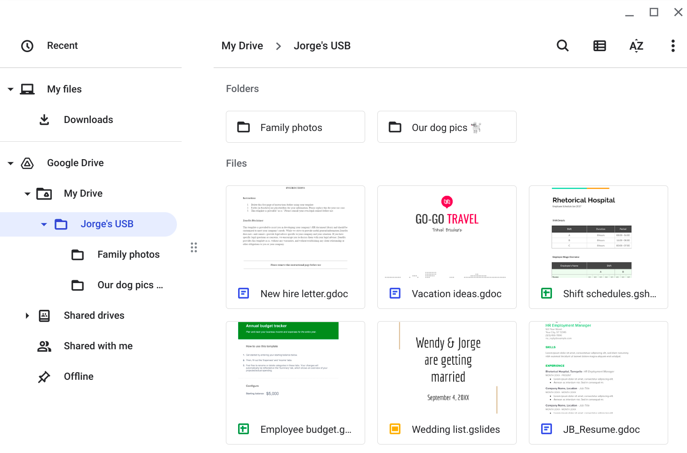

You are part of the security team at Rhetorical Hospital and arrive to work one morning. On the ground of the parking lot, you find a USB stick with the hospital's logo printed on it. There’s no one else around who might have dropped it, so you decide to pick it up out of curiosity.

You bring the USB drive back to your office where the team has virtualization software installed on a workstation. Virtualization software can be used for this very purpose because it’s one of the only ways to safely investigate an unfamiliar USB stick. The software works by running a simulated instance of the computer on the same workstation. This simulation isn’t connected to other files or networks, so the USB drive can’t affect other systems if it happens to be infected with malicious software.

You create a virtual environment and plug the USB drive into the workstation. The contents of the device appear to belong to Jorge Bailey, the human resource manager at Rhetorical Hospital.

Jorge's drive contains a mix of personal and work-related files. For example, it contains folders that appear to store family and pet photos. There is also a new hire letter and an employee shift schedule.

Useful Resources: https://www.cisa.gov/news-events/news/using-caution-usb-drives
