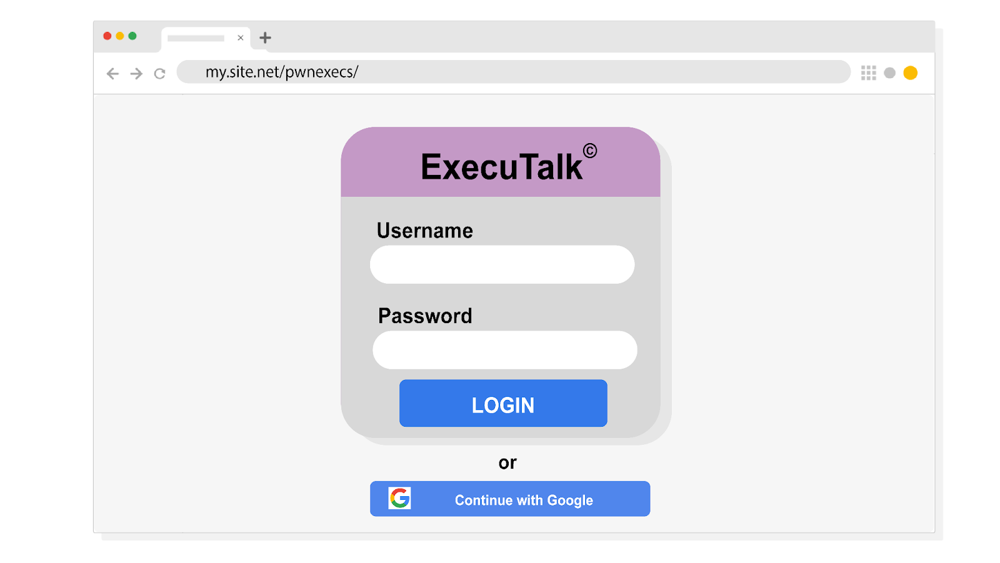

You’re a security analyst at an investment firm called Imaginary Bank. An executive at the firm recently received a spear phishing email that appears to come from the board of Imaginary Bank. Spear phishing is a malicious email attack targeting a specific user or group of users, appearing to originate from a trusted source. In this case, the executive is being asked to install new collaboration software, ExecuTalk.

The executive suspects this email might be a phishing attempt because ExecuTalk was never mentioned during the last board meeting. They've forwarded the message to your team to verify if it’s legitimate. Your supervisor has tasked you with investigating the message and determining whether it should be quarantined.

Start your investigation by analyzing the suspicious message. Try to identify clues that this is a phishing attack against this executive at Imaginary Bank:

---

From: imaginarybank@gmail.org

Sent: Saturday, December 21, 2019 15:05:05

To: cfo@imaginarybank.com

Subject: RE: You are been added to an ecsecutiv's groups

Conglaturations! You have been added to a collaboration group ‘Execs.’

Downlode ExecuTalk to your computer.

Mac® | Windows® | Android™

You're team needs you! This invitation will expire in 48 hours so act quickly.

Sincerely,

ExecuTalk©

All rights reserved.

---

Examine the email header of this suspicious message:

---

From: imaginarybank@gmail.org

Sent: Saturday, December 21, 2019 15:05:05

To: cfo@imaginarybank.com

Subject: RE: You are been added to an ecsecutiv's groups

---

Next, review the body of the message received by the executive at Imaginary Bank. Try to identify three ways this threat actor tried to disguise their message as a legitimate email.

Note: This message is strictly meant to illustrate an example of an email that contains malicious download options.

---

Conglaturations! You have been added to a collaboration group ‘Execs.’

Downlode ExecuTalk to your computer.

Mac® | Windows® | Android™

You're team needs you! This invitation will expire in 48 hours so act quickly.

Sincerely,

ExecuTalk©

All rights reserved.

---

The message contains three download options. Each of them opens this login form:

